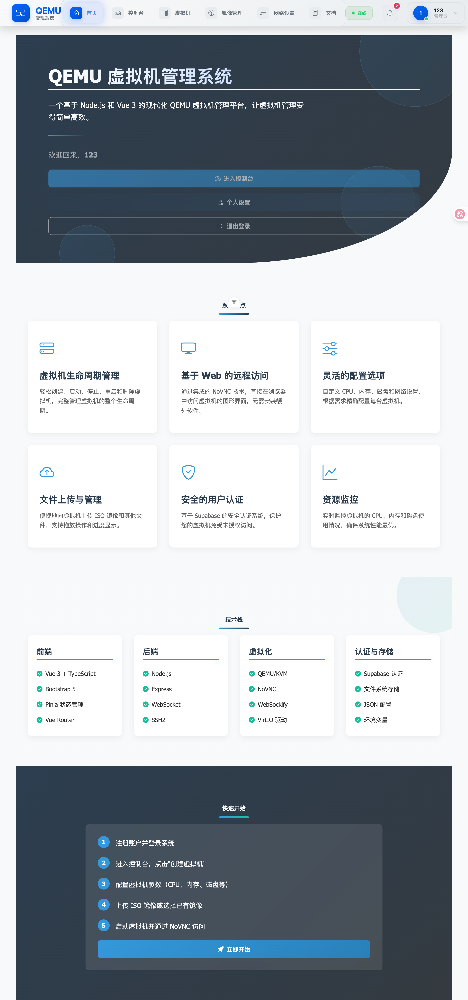
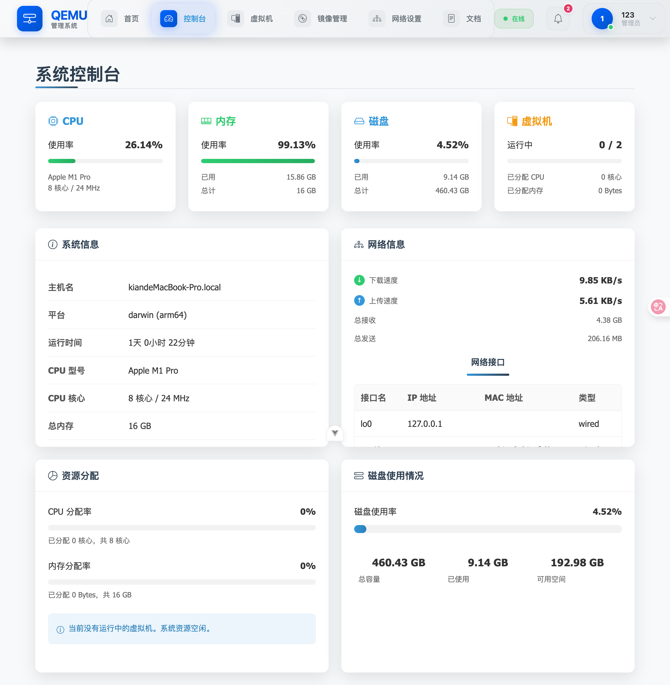
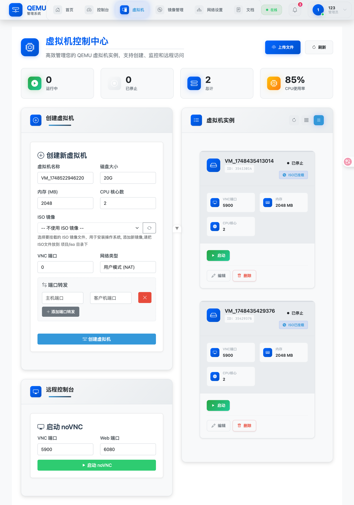
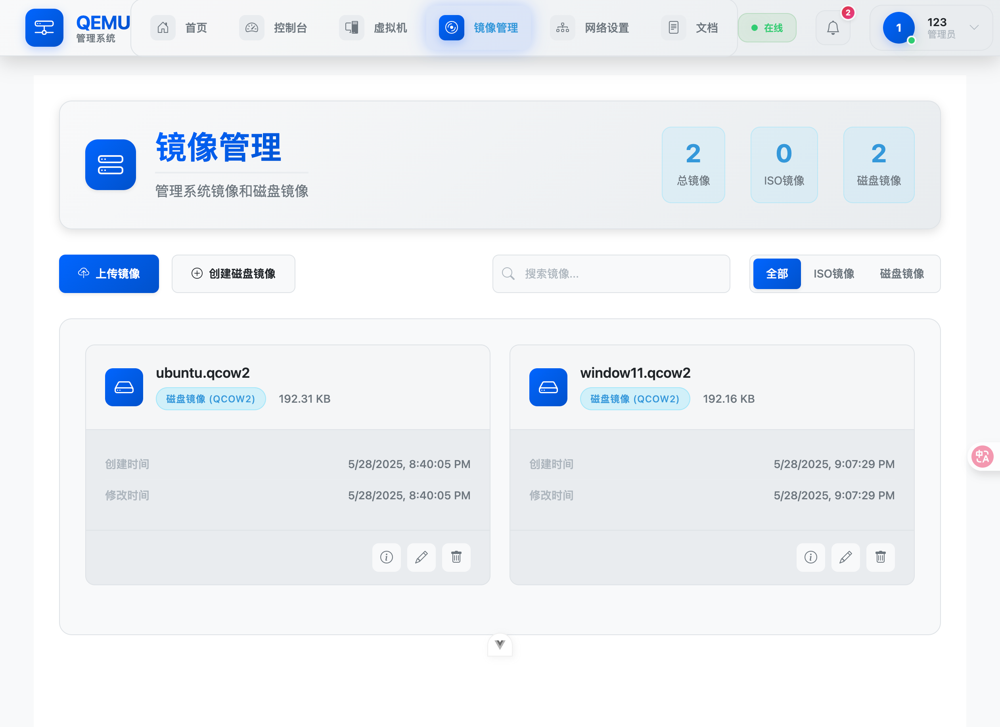
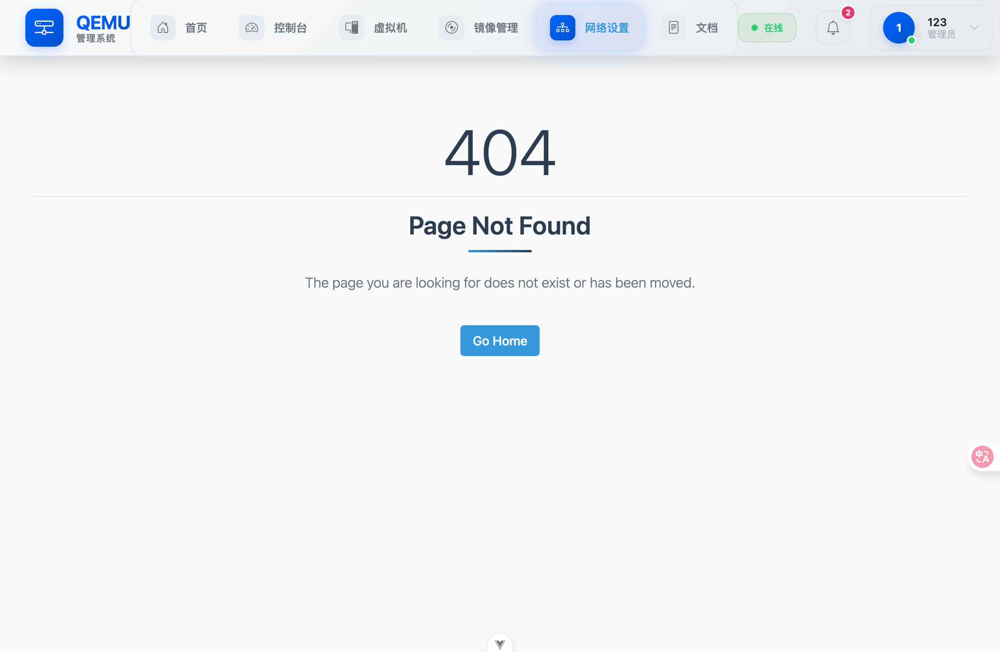
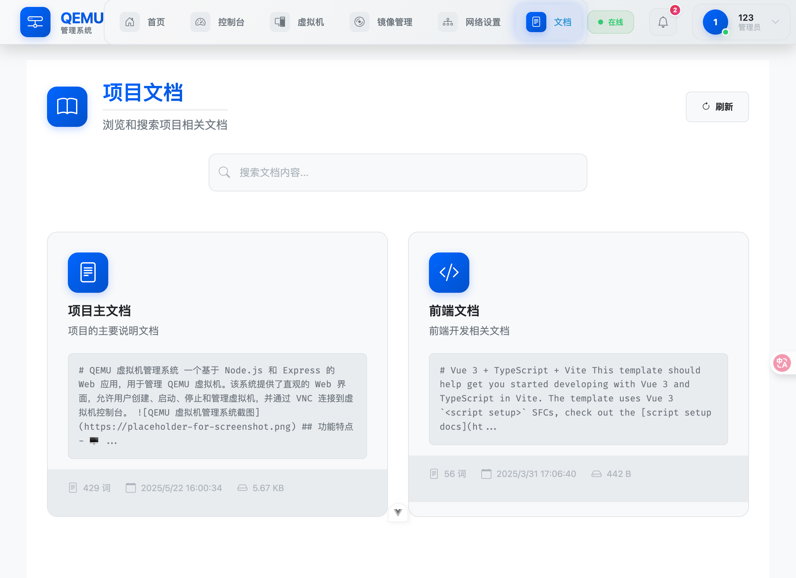

# voidVM

基于 Vue + Node.js + QEMU 的强大虚拟机管理解决方案

> [English](README.md) | [中文](README_ZH.md)

## 📖 项目简介

voidVM 是一个现代化的虚拟机管理平台，提供直观的 Web 界面来创建、配置和管理虚拟机。通过集成 QEMU 虚拟化技术和 Supabase 云数据库，为用户提供便捷、高效的虚拟机管理体验。

## ✨ 特性

- 🖥️ **直观的 Web 界面** - 基于 Vue 构建的现代化用户界面
- 🚀 **强大的虚拟化** - 集成 QEMU 提供完整的虚拟机功能
- ☁️ **云端数据管理** - 使用 Supabase 实现数据持久化和用户认证
- 📱 **响应式设计** - 支持桌面和移动设备访问
- 🔧 **在线管理** - 创建、启动、停止、删除虚拟机
- 📊 **实时监控** - 虚拟机状态和性能监控

## 🛠️ 技术栈

- **前端**: Vue + Composition API
- **后端**: Node.js + Express
- **虚拟化**: QEMU/KVM
- **数据库**: Supabase (PostgreSQL)
- **认证**: Supabase Auth

## 🚀 快速开始

### 环境要求

- Node.js >= 18.0.0
- npm >= 8.0.0
- QEMU 已安装并配置
- Supabase 账户

### 安装步骤

1. **克隆项目**

```bash
git clone https://github.com/Kian-404/voidVM.git
cd voidVM
```

2. **安装依赖**

```bash
pnpm install
```

3. **环境配置**

```bash
# 复制环境变量模板
cp .env.example .env

# 编辑 .env 文件，填入 Supabase 配置
SUPABASE_URL=your_supabase_url
SUPABASE_ANON_KEY=your_supabase_anon_key
SUPABASE_SERVICE_KEY=your_supabase_service_key
```

4. **启动服务**

```bash
pnpm dev
```

### QEMU 配置

确保系统已安装 QEMU：

```bash
# Ubuntu/Debian
sudo apt-get install qemu-kvm qemu-utils

# CentOS/RHEL
sudo yum install qemu-kvm qemu-img

# macOS
brew install qemu
```

## 📱 使用说明

1. **用户注册/登录**

   - 访问 `http://localhost:3000`
   - 使用 Supabase Auth 进行用户认证

2. **创建虚拟机**

   - 点击"创建虚拟机"按钮
   - 配置 CPU、内存、存储等参数
   - 选择操作系统镜像

3. **管理虚拟机**
   - 启动/停止虚拟机
   - 查看虚拟机状态和性能
   - 修改虚拟机配置
   - 删除不需要的虚拟机

## 📝 项目截图

<details>
<summary>系统截图</summary>








</details>

## 📁 项目结构

```
voidVM/
├── web/                 # Vue3 前端应用
│   ├── src/
│   │   ├── components/     # Vue 组件
│   │   ├── views/         # 页面视图
│   │   ├── stores/        # Pinia 状态管理
│   │   └── utils/         # 工具函数
│   └── package.json
├── server/                 # Node.js 后端服务
│   ├── routes/            # API 路由
│   ├── controllers/       # 控制器
│   ├── middleware/        # 中间件
│   ├── services/          # 业务逻辑
│   └── package.json
├── docs/                  # 项目文档
├── scripts/               # 脚本文件
└── README.md
```

## 🔧 API 接口

### 虚拟机管理

- `GET /api/vms` - 获取虚拟机列表
- `POST /api/vms` - 创建虚拟机
- `GET /api/vms/:id` - 获取虚拟机详info
- `PUT /api/vms/:id` - 更新虚拟机配置
- `DELETE /api/vms/:id` - 删除虚拟机
- `POST /api/vms/:id/start` - 启动虚拟机
- `POST /api/vms/:id/stop` - 停止虚拟机

## 🤝 贡献指南

欢迎贡献代码！请遵循以下步骤：

1. Fork 本仓库
2. 创建特性分支 (`git checkout -b feature/AmazingFeature`)
3. 提交更改 (`git commit -m 'Add some AmazingFeature'`)
4. 推送到分支 (`git push origin feature/AmazingFeature`)
5. 开启 Pull Request

## 📄 许可证

本项目采用 MIT 许可证 - 查看 [LICENSE](LICENSE) 文件了解详情

## 🙏 致谢

- [Vue.js](https://vuejs.org/) - 渐进式 JavaScript 框架
- [Node.js](https://nodejs.org/) - JavaScript 运行时
- [QEMU](https://www.qemu.org/) - 开源虚拟化软件
- [Supabase](https://supabase.com/) - 开源 Firebase 替代方案

## 📞 联系方式

如有问题或建议，请通过以下方式联系：

- 提交 [Issue](https://github.com/Kian-404/voidVM/issues)
