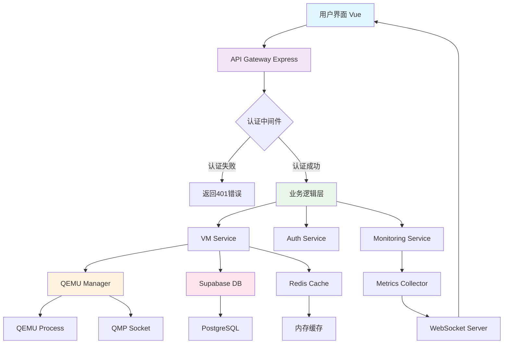

# 🏗️ 系统架构设计

voidVM 采用前后端分离的现代化架构，通过微服务设计实现高可用、可扩展的虚拟机管理平台。

## 整体架构图

```
┌─────────────────┐    ┌─────────────────┐    ┌─────────────────┐
│   Web Browser   │    │   Mobile App    │    │   Desktop App   │
│    (Vue)        │    │    (Future)     │    │    (Future)     │
└─────────┬───────┘    └─────────┬───────┘    └─────────┬───────┘
          │                      │                      │
          └──────────────────────┼──────────────────────┘
                                 │
                    ┌────────────┴───────────────┐
                    │      Load Balancer         │
                    │       (Nginx)              │
                    └────────────┬───────────────┘
                                 │
          ┌──────────────────────┼──────────────────────┐
          │                      │                      │
┌─────────┴───────┐    ┌─────────┴───────┐    ┌─────────┴───────┐
│   API Gateway   │    │   Static Files  │    │   WebSocket     │
│   (Express.js)  │    │    (Assets)     │    │   (Socket.io)   │
└─────────┬───────┘    └─────────────────┘    └─────────┬───────┘
          │                                             │
┌─────────┴─────────────────────────────────────────────┴────────┐
│                    Backend Services                            │
├────────────────────────────────────────────────────────────────┤
│  ┌─────────────┐  ┌─────────────┐  ┌─────────────┐             │
│  │    VM       │  │   Auth      │  │ Monitoring  │             │
│  │  Service    │  │  Service    │  │  Service    │             │
│  └─────────────┘  └─────────────┘  └─────────────┘             │
│                                                                │
│  ┌─────────────┐  ┌─────────────┐  ┌─────────────┐             │
│  │   Image     │  │   Network   │  │   Storage   │             │
│  │  Service    │  │  Service    │  │  Service    │             │
│  └─────────────┘  └─────────────┘  └─────────────┘             │
└────────────────────────────────────────────────────────────────┘
                                 │
          ┌──────────────────────┼──────────────────────┐
          │                      │                      │
┌─────────┴───────┐    ┌─────────┴───────┐    ┌─────────┴───────┐
│   Supabase      │    │     QEMU        │    │    Host OS      │
│  (Database)     │    │  Hypervisor     │    │   Resources     │
└─────────────────┘    └─────────────────┘    └─────────────────┘
```

## 前端架构 (Vue)

```
Frontend Architecture
├── src/
│   ├── components/          # 可复用组件
│   │   ├── common/         # 通用组件
│   │   │   ├── Loading.vue
│   │   │   ├── Modal.vue
│   │   │   └── Toast.vue
│   │   ├── vm/             # 虚拟机相关组件
│   │   │   ├── VMCard.vue
│   │   │   ├── VMConsole.vue
│   │   │   ├── VMMetrics.vue
│   │   │   └── VMSettings.vue
│   │   └── layout/         # 布局组件
│   │       ├── Header.vue
│   │       ├── Sidebar.vue
│   │       └── Footer.vue
│   ├── views/              # 页面视图
│   │   ├── Dashboard.vue
│   │   ├── VMList.vue
│   │   ├── VMDetail.vue
│   │   └── Settings.vue
│   ├── stores/             # Pinia 状态管理
│   │   ├── auth.js
│   │   ├── vm.js
│   │   └── ui.js
│   ├── composables/        # 组合式函数
│   │   ├── useAuth.js
│   │   ├── useVM.js
│   │   └── useWebSocket.js
│   ├── services/           # API 服务层
│   │   ├── api.js
│   │   ├── vmService.js
│   │   └── authService.js
│   └── utils/              # 工具函数
│       ├── constants.js
│       ├── helpers.js
│       └── validators.js
```

**前端技术选型**:

- **Vue**: 采用 Composition API，提供更好的逻辑复用和类型推断
- **Vue Router**: 单页面应用路由管理
- **Pinia**: 现代化状态管理，替代 Vuex
- **Vite**: 快速的构建工具和开发服务器
- **BootStrap**: UI 组件库
- **Socket.io Client**: 实时通信

## 后端架构 (Node.js)

```
Backend Architecture
├── server/
│   ├── routes/              # 路由层
│   │   ├── auth.js         # 认证路由
│   │   ├── vms.js          # 虚拟机路由
│   │   ├── images.js       # 镜像路由
│   │   └── monitoring.js   # 监控路由
│   ├── controllers/         # 控制器层
│   │   ├── AuthController.js
│   │   ├── VMController.js
│   │   ├── ImageController.js
│   │   └── MonitoringController.js
│   ├── services/            # 业务逻辑层
│   │   ├── VMService.js     # 虚拟机服务
│   │   ├── QEMUService.js   # QEMU 管理服务
│   │   ├── AuthService.js   # 认证服务
│   │   ├── ImageService.js  # 镜像管理服务
│   │   ├── NetworkService.js # 网络管理服务
│   │   └── StorageService.js # 存储管理服务
│   ├── middleware/          # 中间件
│   │   ├── auth.js         # 认证中间件
│   │   ├── validation.js   # 参数验证
│   │   ├── rateLimiter.js  # 限流中间件
│   │   └── errorHandler.js # 错误处理
│   ├── models/              # 数据模型
│   │   ├── VM.js
│   │   ├── User.js
│   │   └── Image.js
│   ├── utils/               # 工具类
│   │   ├── qemuWrapper.js  # QEMU 命令封装
│   │   ├── logger.js       # 日志工具
│   │   └── validators.js   # 验证工具
│   └── config/              # 配置文件
│       ├── database.js     # 数据库配置
│       ├── qemu.js         # QEMU 配置
│       └── supabase.js     # Supabase 配置
```

**后端技术选型**:

- **Express.js**: Web 框架
- **Socket.io**: WebSocket 实时通信
- **Joi**: 参数验证
- **Winston**: 日志记录
- **Node-cron**: 定时任务
- **Multer**: 文件上传处理

## 数据库设计 (Supabase/PostgreSQL)

```sql
-- 用户表
CREATE TABLE users (
    id UUID PRIMARY KEY DEFAULT uuid_generate_v4(),
    email VARCHAR(255) UNIQUE NOT NULL,
    username VARCHAR(100) UNIQUE NOT NULL,
    avatar_url TEXT,
    role VARCHAR(20) DEFAULT 'user',
    created_at TIMESTAMP WITH TIME ZONE DEFAULT NOW(),
    updated_at TIMESTAMP WITH TIME ZONE DEFAULT NOW()
);

-- 虚拟机表
CREATE TABLE virtual_machines (
    id UUID PRIMARY KEY DEFAULT uuid_generate_v4(),
    user_id UUID REFERENCES users(id) ON DELETE CASCADE,
    name VARCHAR(100) NOT NULL,
    description TEXT,
    status VARCHAR(20) DEFAULT 'stopped', -- stopped, running, paused, error
    cpu_cores INTEGER DEFAULT 1,
    memory_mb INTEGER DEFAULT 1024,
    disk_size_gb INTEGER DEFAULT 20,
    os_type VARCHAR(50),
    image_id UUID REFERENCES vm_images(id),
    network_config JSONB,
    qemu_config JSONB,
    created_at TIMESTAMP WITH TIME ZONE DEFAULT NOW(),
    updated_at TIMESTAMP WITH TIME ZONE DEFAULT NOW()
);

-- 虚拟机镜像表
CREATE TABLE vm_images (
    id UUID PRIMARY KEY DEFAULT uuid_generate_v4(),
    name VARCHAR(100) NOT NULL,
    description TEXT,
    os_type VARCHAR(50),
    version VARCHAR(50),
    file_path TEXT NOT NULL,
    file_size_bytes BIGINT,
    checksum VARCHAR(64),
    is_public BOOLEAN DEFAULT false,
    created_by UUID REFERENCES users(id),
    created_at TIMESTAMP WITH TIME ZONE DEFAULT NOW()
);

-- 虚拟机监控数据表
CREATE TABLE vm_metrics (
    id UUID PRIMARY KEY DEFAULT uuid_generate_v4(),
    vm_id UUID REFERENCES virtual_machines(id) ON DELETE CASCADE,
    cpu_usage DECIMAL(5,2),
    memory_usage DECIMAL(5,2),
    disk_usage DECIMAL(5,2),
    network_in_bytes BIGINT,
    network_out_bytes BIGINT,
    timestamp TIMESTAMP WITH TIME ZONE DEFAULT NOW()
);

-- 操作日志表
CREATE TABLE operation_logs (
    id UUID PRIMARY KEY DEFAULT uuid_generate_v4(),
    user_id UUID REFERENCES users(id),
    vm_id UUID REFERENCES virtual_machines(id),
    operation VARCHAR(50), -- create, start, stop, delete, etc.
    status VARCHAR(20), -- success, failed, pending
    details JSONB,
    created_at TIMESTAMP WITH TIME ZONE DEFAULT NOW()
);
```

## QEMU 集成架构

```javascript
// QEMU 服务抽象层
class QEMUService {
  constructor() {
    this.runningVMs = new Map() // 运行中的虚拟机实例
    this.qmpSockets = new Map() // QMP 监控套接字
  }

  // 创建虚拟机
  async createVM(vmConfig) {
    const qemuArgs = this.buildQEMUArgs(vmConfig)
    const vmProcess = spawn('qemu-system-x86_64', qemuArgs)

    this.runningVMs.set(vmConfig.id, vmProcess)
    this.setupQMPConnection(vmConfig.id)

    return vmProcess
  }

  // 构建 QEMU 参数
  buildQEMUArgs(config) {
    return [
      '-m',
      `${config.memory}M`,
      '-smp',
      `cores=${config.cpu}`,
      '-hda',
      config.diskPath,
      '-netdev',
      'user,id=net0',
      '-device',
      'e1000,netdev=net0',
      '-vnc',
      `:${config.vncPort}`,
      '-qmp',
      `unix:${config.qmpSocket},server,nowait`,
      config.cdrom ? ['-cdrom', config.cdrom] : [],
    ]
      .flat()
      .filter(Boolean)
  }

  // QMP 监控连接
  setupQMPConnection(vmId) {
    // 通过 QMP 协议监控虚拟机状态
    // 获取 CPU、内存、网络使用情况
  }
}
```

## 实时通信架构

```javascript
// WebSocket 服务
class WebSocketService {
  constructor(server) {
    this.io = socketIO(server, {
      cors: { origin: '*' },
    })

    this.setupEventHandlers()
  }

  setupEventHandlers() {
    this.io.on('connection', socket => {
      // 用户认证
      socket.on('authenticate', async token => {
        const user = await this.verifyToken(token)
        socket.userId = user.id
        socket.join(`user:${user.id}`)
      })

      // 订阅虚拟机状态
      socket.on('subscribe:vm', vmId => {
        socket.join(`vm:${vmId}`)
      })

      // 虚拟机操作
      socket.on('vm:start', async vmId => {
        try {
          await VMService.startVM(vmId)
          this.io.to(`vm:${vmId}`).emit('vm:status', {
            vmId,
            status: 'starting',
          })
        } catch (error) {
          socket.emit('error', error.message)
        }
      })
    })
  }

  // 广播虚拟机状态更新
  broadcastVMStatus(vmId, status, metrics) {
    this.io.to(`vm:${vmId}`).emit('vm:status', {
      vmId,
      status,
      metrics,
      timestamp: new Date().toISOString(),
    })
  }
}
```

## 安全架构

```javascript
// 安全中间件
const securityMiddleware = {
  // JWT 认证
  authenticate: async (req, res, next) => {
    const token = req.headers.authorization?.split(' ')[1]
    const user = await supabase.auth.getUser(token)
    req.user = user
    next()
  },

  // 权限检查
  authorize: permissions => {
    return (req, res, next) => {
      if (!req.user.permissions.includes(permissions)) {
        return res.status(403).json({ error: 'Forbidden' })
      }
      next()
    }
  },

  // 资源访问控制
  checkVMOwnership: async (req, res, next) => {
    const vmId = req.params.id
    const vm = await VMService.getVM(vmId)

    if (vm.user_id !== req.user.id && req.user.role !== 'admin') {
      return res.status(403).json({ error: 'Access denied' })
    }
    next()
  },

  // 限流
  rateLimit: rateLimit({
    windowMs: 15 * 60 * 1000, // 15 minutes
    max: 100, // limit each IP to 100 requests per windowMs
    message: 'Too many requests from this IP',
  }),

  // 输入验证和清理
  validateInput: schema => {
    return (req, res, next) => {
      const { error, value } = schema.validate(req.body)
      if (error) {
        return res.status(400).json({ error: error.details[0].message })
      }
      req.body = value
      next()
    }
  },

  // CSRF 保护
  csrfProtection: csrf({
    cookie: {
      httpOnly: true,
      secure: process.env.NODE_ENV === 'production',
      sameSite: 'strict',
    },
  }),
}
```

## 监控与日志架构

```javascript
// 监控服务
class MonitoringService {
  constructor() {
    this.metrics = new Map()
    this.startMetricsCollection()
  }

  // 收集系统指标
  async collectSystemMetrics() {
    return {
      cpu: await this.getCPUUsage(),
      memory: await this.getMemoryUsage(),
      disk: await this.getDiskUsage(),
      network: await this.getNetworkStats(),
      timestamp: new Date().toISOString(),
    }
  }

  // 收集虚拟机指标
  async collectVMMetrics(vmId) {
    const vm = this.runningVMs.get(vmId)
    if (!vm) return null

    try {
      // 通过 QMP 协议获取虚拟机指标
      const qmpClient = this.qmpSockets.get(vmId)
      const metrics = await qmpClient.query({
        execute: 'query-status',
      })

      return {
        vmId,
        status: metrics.status,
        cpu: await this.getVMCPUUsage(vmId),
        memory: await this.getVMMemoryUsage(vmId),
        disk: await this.getVMDiskUsage(vmId),
        network: await this.getVMNetworkStats(vmId),
        timestamp: new Date().toISOString(),
      }
    } catch (error) {
      logger.error(`Failed to collect metrics for VM ${vmId}:`, error)
      return null
    }
  }

  // 启动指标收集定时任务
  startMetricsCollection() {
    // 每30秒收集一次系统指标
    cron.schedule('*/30 * * * * *', async () => {
      const metrics = await this.collectSystemMetrics()
      await this.storeMetrics('system', metrics)
    })

    // 每15秒收集一次虚拟机指标
    cron.schedule('*/15 * * * * *', async () => {
      for (const vmId of this.runningVMs.keys()) {
        const metrics = await this.collectVMMetrics(vmId)
        if (metrics) {
          await this.storeMetrics('vm', metrics)
          // 通过 WebSocket 广播实时指标
          wsService.broadcastVMMetrics(vmId, metrics)
        }
      }
    })
  }

  // 存储指标到数据库
  async storeMetrics(type, metrics) {
    try {
      if (type === 'vm') {
        await supabase.from('vm_metrics').insert({
          vm_id: metrics.vmId,
          cpu_usage: metrics.cpu,
          memory_usage: metrics.memory,
          disk_usage: metrics.disk,
          network_in_bytes: metrics.network.in,
          network_out_bytes: metrics.network.out,
          timestamp: metrics.timestamp,
        })
      }
    } catch (error) {
      logger.error('Failed to store metrics:', error)
    }
  }
}

// 日志服务
const logger = winston.createLogger({
  level: 'info',
  format: winston.format.combine(
    winston.format.timestamp(),
    winston.format.errors({ stack: true }),
    winston.format.json()
  ),
  defaultMeta: { service: 'voidVM' },
  transports: [
    // 错误日志写入文件
    new winston.transports.File({
      filename: 'logs/error.log',
      level: 'error',
    }),
    // 所有日志写入文件
    new winston.transports.File({
      filename: 'logs/combined.log',
    }),
    // 开发环境输出到控制台
    ...(process.env.NODE_ENV !== 'production'
      ? [
          new winston.transports.Console({
            format: winston.format.simple(),
          }),
        ]
      : []),
  ],
})
```

## 缓存架构

```javascript
// Redis 缓存服务
class CacheService {
  constructor() {
    this.redis = new Redis({
      host: process.env.REDIS_HOST || 'localhost',
      port: process.env.REDIS_PORT || 6379,
      password: process.env.REDIS_PASSWORD,
      db: 0,
    })
  }

  // 缓存虚拟机状态
  async cacheVMStatus(vmId, status, ttl = 300) {
    const key = `vm:status:${vmId}`
    await this.redis.setex(key, ttl, JSON.stringify(status))
  }

  // 获取缓存的虚拟机状态
  async getCachedVMStatus(vmId) {
    const key = `vm:status:${vmId}`
    const cached = await this.redis.get(key)
    return cached ? JSON.parse(cached) : null
  }

  // 缓存用户会话
  async cacheUserSession(userId, sessionData, ttl = 3600) {
    const key = `session:${userId}`
    await this.redis.setex(key, ttl, JSON.stringify(sessionData))
  }

  // 清除虚拟机相关缓存
  async clearVMCache(vmId) {
    const pattern = `vm:*:${vmId}`
    const keys = await this.redis.keys(pattern)
    if (keys.length > 0) {
      await this.redis.del(...keys)
    }
  }
}
```

## 部署架构

```yaml
# docker-compose.yml
version: '3.8'

services:
  # 前端服务
  frontend:
    build:
      context: ./client
      dockerfile: Dockerfile
    ports:
      - '3000:80'
    environment:
      - VITE_API_URL=http://localhost:5000
      - VITE_SUPABASE_URL=${SUPABASE_URL}
      - VITE_SUPABASE_ANON_KEY=${SUPABASE_ANON_KEY}
    depends_on:
      - backend

  # 后端服务
  backend:
    build:
      context: ./server
      dockerfile: Dockerfile
    ports:
      - '5000:5000'
    environment:
      - NODE_ENV=production
      - SUPABASE_URL=${SUPABASE_URL}
      - SUPABASE_SERVICE_KEY=${SUPABASE_SERVICE_KEY}
      - REDIS_HOST=redis
    volumes:
      - /var/lib/libvirt:/var/lib/libvirt
      - /dev/kvm:/dev/kvm
    privileged: true
    depends_on:
      - redis
      - postgres

  # Redis 缓存
  redis:
    image: redis:7-alpine
    ports:
      - '6379:6379'
    volumes:
      - redis_data:/data
    command: redis-server --appendonly yes

  # PostgreSQL (备用，主要使用 Supabase)
  postgres:
    image: postgres:15
    environment:
      - POSTGRES_DB=voidvm
      - POSTGRES_USER=${DB_USER}
      - POSTGRES_PASSWORD=${DB_PASSWORD}
    volumes:
      - postgres_data:/var/lib/postgresql/data
    ports:
      - '5432:5432'

  # Nginx 反向代理
  nginx:
    image: nginx:alpine
    ports:
      - '80:80'
      - '443:443'
    volumes:
      - ./nginx.conf:/etc/nginx/nginx.conf
      - ./ssl:/etc/nginx/ssl
    depends_on:
      - frontend
      - backend

volumes:
  redis_data:
  postgres_data:
```

## 性能优化架构

```javascript
// 性能优化服务
class PerformanceService {
  constructor() {
    this.vmQueue = new Queue('vm-operations', {
      redis: {
        host: process.env.REDIS_HOST,
        port: process.env.REDIS_PORT,
      },
    })

    this.setupQueueProcessors()
  }

  // 设置队列处理器
  setupQueueProcessors() {
    // 虚拟机启动队列
    this.vmQueue.process('start-vm', 5, async job => {
      const { vmId, userId } = job.data
      return await VMService.startVM(vmId, userId)
    })

    // 虚拟机停止队列
    this.vmQueue.process('stop-vm', 10, async job => {
      const { vmId, userId } = job.data
      return await VMService.stopVM(vmId, userId)
    })

    // 镜像构建队列
    this.vmQueue.process('build-image', 2, async job => {
      const { imageConfig } = job.data
      return await ImageService.buildImage(imageConfig)
    })
  }

  // 异步执行虚拟机操作
  async queueVMOperation(operation, vmId, userId) {
    const job = await this.vmQueue.add(
      `${operation}-vm`,
      {
        vmId,
        userId,
        timestamp: new Date().toISOString(),
      },
      {
        attempts: 3,
        backoff: {
          type: 'exponential',
          delay: 2000,
        },
      }
    )

    return job.id
  }

  // 连接池管理
  setupConnectionPool() {
    // 数据库连接池
    this.dbPool = new Pool({
      connectionString: process.env.DATABASE_URL,
      max: 20,
      idleTimeoutMillis: 30000,
      connectionTimeoutMillis: 2000,
    })

    // QEMU 进程池
    this.qemuPool = new Map()
  }
}
```

## 灾难恢复架构

```javascript
// 备份恢复服务
class BackupService {
  constructor() {
    this.setupScheduledBackups()
  }

  // 虚拟机快照
  async createVMSnapshot(vmId, snapshotName) {
    try {
      logger.info(`Creating snapshot ${snapshotName} for VM ${vmId}`)

      const vm = await VMService.getVM(vmId)
      const qmpClient = this.qmpSockets.get(vmId)

      // 创建内存快照
      await qmpClient.execute('savevm', {
        name: snapshotName,
      })

      // 创建磁盘快照
      await this.createDiskSnapshot(vm.disk_path, snapshotName)

      // 记录快照信息
      await supabase.from('vm_snapshots').insert({
        vm_id: vmId,
        name: snapshotName,
        type: 'full',
        created_at: new Date().toISOString(),
      })

      logger.info(`Snapshot ${snapshotName} created successfully`)
      return true
    } catch (error) {
      logger.error(`Failed to create snapshot: ${error.message}`)
      throw error
    }
  }

  // 恢复虚拟机快照
  async restoreVMSnapshot(vmId, snapshotName) {
    try {
      logger.info(`Restoring snapshot ${snapshotName} for VM ${vmId}`)

      // 停止虚拟机
      await VMService.stopVM(vmId)

      // 恢复磁盘
      await this.restoreDiskSnapshot(vmId, snapshotName)

      // 启动虚拟机并加载内存快照
      await VMService.startVM(vmId)
      const qmpClient = this.qmpSockets.get(vmId)
      await qmpClient.execute('loadvm', {
        name: snapshotName,
      })

      logger.info(`Snapshot ${snapshotName} restored successfully`)
      return true
    } catch (error) {
      logger.error(`Failed to restore snapshot: ${error.message}`)
      throw error
    }
  }

  // 定时备份
  setupScheduledBackups() {
    // 每天凌晨2点执行自动备份
    cron.schedule('0 2 * * *', async () => {
      const runningVMs = await VMService.getRunningVMs()

      for (const vm of runningVMs) {
        try {
          const snapshotName = `auto_${new Date().toISOString().split('T')[0]}`
          await this.createVMSnapshot(vm.id, snapshotName)
        } catch (error) {
          logger.error(`Auto backup failed for VM ${vm.id}: ${error.message}`)
        }
      }
    })
  }
}
```

## API 设计规范

```javascript
// RESTful API 设计
const apiRoutes = {
    // 虚拟机管理
    'GET /api/v1/vms': 'List all VMs for authenticated user',
    'POST /api/v1/vms': 'Create a new VM',
    'GET /api/v1/vms/:id': 'Get VM details',
    'PUT /api/v1/vms/:id': 'Update VM configuration',
    'DELETE /api/v1/vms/:id': 'Delete VM',

    // 虚拟机操作
    'POST /api/v1/vms/:id/start': 'Start VM',
    'POST /api/v1/vms/:id/stop': 'Stop VM',
    'POST /api/v1/vms/:id/pause': 'Pause VM',
    'POST /api/v1/vms/:id/resume': 'Resume VM',
    'POST /api/v1/vms/:id/reset': 'Reset VM',

    // 快照管理
    'GET /api/v1/vms/:id/snapshots': 'List VM snapshots',
    'POST /api/v1/vms/:id/snapshots': 'Create VM snapshot',
    'POST /api/v1/vms/:id/snapshots/:name/restore': 'Restore snapshot',
    'DELETE /api/v1/vms/:id/snapshots/:name
    'DELETE /api/v1/vms/:id/snapshots/:name': 'Delete snapshot',

    // 监控和指标
    'GET /api/v1/vms/:id/metrics': 'Get VM performance metrics',
    'GET /api/v1/vms/:id/console': 'Get VM console access',
    'GET /api/v1/vms/:id/logs': 'Get VM operation logs',

    // 镜像管理
    'GET /api/v1/images': 'List available VM images',
    'POST /api/v1/images': 'Upload new VM image',
    'GET /api/v1/images/:id': 'Get image details',
    'DELETE /api/v1/images/:id': 'Delete VM image',

    // 网络管理
    'GET /api/v1/networks': 'List virtual networks',
    'POST /api/v1/networks': 'Create virtual network',
    'GET /api/v1/networks/:id': 'Get network details',
    'PUT /api/v1/networks/:id': 'Update network configuration',
    'DELETE /api/v1/networks/:id': 'Delete virtual network',

    // 存储管理
    'GET /api/v1/storage': 'List storage pools',
    'POST /api/v1/storage': 'Create storage pool',
    'GET /api/v1/storage/:id/volumes': 'List volumes in storage pool',
    'POST /api/v1/storage/:id/volumes': 'Create new volume',

    // 用户管理
    'GET /api/v1/users/profile': 'Get user profile',
    'PUT /api/v1/users/profile': 'Update user profile',
    'GET /api/v1/users/usage': 'Get resource usage statistics',

    // 系统管理
    'GET /api/v1/system/stats': 'Get system statistics',
    'GET /api/v1/system/health': 'Health check endpoint',
    'GET /api/v1/system/version': 'Get system version info'
};

// API 响应格式标准
const ApiResponse = {
    success: {
        code: 200,
        message: 'Success',
        data: {},
        timestamp: new Date().toISOString()
    },
    error: {
        code: 400,
        message: 'Error message',
        error: 'Detailed error information',
        timestamp: new Date().toISOString()
    }
};
```

## 扩展性架构

```javascript
// 微服务架构扩展
class MicroserviceArchitecture {
  constructor() {
    this.services = new Map()
    this.serviceRegistry = new ServiceRegistry()
    this.loadBalancer = new LoadBalancer()
  }

  // 服务注册
  registerService(serviceName, serviceInstance) {
    this.services.set(serviceName, serviceInstance)
    this.serviceRegistry.register(serviceName, serviceInstance)
  }

  // 服务发现
  async discoverService(serviceName) {
    return await this.serviceRegistry.discover(serviceName)
  }

  // 负载均衡
  async routeRequest(serviceName, request) {
    const serviceInstances = await this.discoverService(serviceName)
    const selectedInstance = this.loadBalancer.select(serviceInstances)
    return await selectedInstance.handleRequest(request)
  }
}

// 服务注册中心
class ServiceRegistry {
  constructor() {
    this.services = new Map()
    this.healthChecker = new HealthChecker()
  }

  register(serviceName, instance) {
    if (!this.services.has(serviceName)) {
      this.services.set(serviceName, [])
    }
    this.services.get(serviceName).push(instance)

    // 启动健康检查
    this.healthChecker.monitor(instance)
  }

  async discover(serviceName) {
    const instances = this.services.get(serviceName) || []
    // 返回健康的服务实例
    return instances.filter(instance => instance.isHealthy)
  }
}

// 容器化扩展
class ContainerOrchestration {
  constructor() {
    this.docker = new Docker()
    this.kubernetes = new KubernetesClient()
  }

  // Docker 容器管理
  async deployService(serviceName, config) {
    const container = await this.docker.createContainer({
      Image: config.image,
      name: serviceName,
      Env: config.environment,
      PortBindings: config.ports,
      RestartPolicy: { Name: 'unless-stopped' },
    })

    await container.start()
    return container
  }

  // Kubernetes 部署
  async deployToK8s(serviceName, manifest) {
    await this.kubernetes.apply(manifest)
    return await this.kubernetes.waitForDeployment(serviceName)
  }
}
```

## 安全加固架构

```javascript
// 安全服务
class SecurityService {
  constructor() {
    this.setupSecurityPolicies()
    this.auditLogger = new AuditLogger()
  }

  // 设置安全策略
  setupSecurityPolicies() {
    // 密码策略
    this.passwordPolicy = {
      minLength: 8,
      requireUppercase: true,
      requireLowercase: true,
      requireNumbers: true,
      requireSpecialChars: true,
      maxAge: 90, // days
    }

    // 会话策略
    this.sessionPolicy = {
      maxAge: 3600, // 1 hour
      maxConcurrentSessions: 5,
      requireMFA: false,
    }

    // 访问控制策略
    this.accessPolicy = {
      maxFailedAttempts: 5,
      lockoutDuration: 1800, // 30 minutes
      allowedIPs: [], // empty = allow all
      blockedIPs: [],
    }
  }

  // 多因素认证
  async setupMFA(userId, method = 'totp') {
    const secret = authenticator.generateSecret()
    const qrCode = await QRCode.toDataURL(authenticator.keyuri(userId, 'voidVM', secret))

    await supabase.from('user_mfa').insert({
      user_id: userId,
      method,
      secret: this.encrypt(secret),
      enabled: false,
    })

    return { secret, qrCode }
  }

  // 验证 MFA
  async verifyMFA(userId, token) {
    const mfaRecord = await supabase
      .from('user_mfa')
      .select('secret')
      .eq('user_id', userId)
      .single()

    if (!mfaRecord) {
      throw new Error('MFA not configured')
    }

    const secret = this.decrypt(mfaRecord.secret)
    return authenticator.verify({ token, secret })
  }

  // 审计日志
  async logSecurityEvent(event) {
    await this.auditLogger.log({
      type: 'security',
      event: event.type,
      userId: event.userId,
      ip: event.ip,
      userAgent: event.userAgent,
      details: event.details,
      timestamp: new Date().toISOString(),
    })
  }

  // 加密解密
  encrypt(text) {
    const cipher = crypto.createCipher('aes-256-cbc', process.env.ENCRYPTION_KEY)
    let encrypted = cipher.update(text, 'utf8', 'hex')
    encrypted += cipher.final('hex')
    return encrypted
  }

  decrypt(encryptedText) {
    const decipher = crypto.createDecipher('aes-256-cbc', process.env.ENCRYPTION_KEY)
    let decrypted = decipher.update(encryptedText, 'hex', 'utf8')
    decrypted += decipher.final('utf8')
    return decrypted
  }
}
```

## 测试架构

```javascript
// 测试框架
describe('voidVM Test Suite', () => {
  // 单元测试
  describe('Unit Tests', () => {
    describe('VM Service', () => {
      it('should create a new VM', async () => {
        const vmConfig = {
          name: 'test-vm',
          cpu: 2,
          memory: 2048,
          disk: 20,
        }

        const vm = await VMService.createVM(vmConfig)
        expect(vm).to.have.property('id')
        expect(vm.name).to.equal('test-vm')
      })

      it('should start a VM', async () => {
        const vmId = 'test-vm-id'
        const result = await VMService.startVM(vmId)
        expect(result).to.be.true
      })
    })

    describe('QEMU Service', () => {
      it('should build correct QEMU arguments', () => {
        const config = {
          memory: 2048,
          cpu: 2,
          diskPath: '/path/to/disk.qcow2',
        }

        const args = QEMUService.buildQEMUArgs(config)
        expect(args).to.include('-m')
        expect(args).to.include('2048M')
      })
    })
  })

  // 集成测试
  describe('Integration Tests', () => {
    describe('API Endpoints', () => {
      it('should create VM via API', async () => {
        const response = await request(app)
          .post('/api/v1/vms')
          .set('Authorization', `Bearer ${testToken}`)
          .send({
            name: 'integration-test-vm',
            cpu: 1,
            memory: 1024,
          })

        expect(response.status).to.equal(201)
        expect(response.body.data).to.have.property('id')
      })
    })

    describe('Database Operations', () => {
      it('should store VM configuration', async () => {
        const vm = await VMService.createVM(testVMConfig)
        const stored = await supabase.from('virtual_machines').select('*').eq('id', vm.id).single()

        expect(stored.data).to.not.be.null
      })
    })
  })

  // 端到端测试
  describe('E2E Tests', () => {
    describe('VM Lifecycle', () => {
      it('should complete full VM lifecycle', async () => {
        // 创建虚拟机
        const vm = await VMService.createVM(testVMConfig)

        // 启动虚拟机
        await VMService.startVM(vm.id)
        expect(await VMService.getVMStatus(vm.id)).to.equal('running')

        // 停止虚拟机
        await VMService.stopVM(vm.id)
        expect(await VMService.getVMStatus(vm.id)).to.equal('stopped')

        // 删除虚拟机
        await VMService.deleteVM(vm.id)
        const deleted = await VMService.getVM(vm.id)
        expect(deleted).to.be.null
      })
    })
  })

  // 性能测试
  describe('Performance Tests', () => {
    it('should handle concurrent VM operations', async () => {
      const promises = []
      const vmCount = 10

      for (let i = 0; i < vmCount; i++) {
        promises.push(
          VMService.createVM({
            name: `perf-test-vm-${i}`,
            cpu: 1,
            memory: 512,
          })
        )
      }

      const results = await Promise.all(promises)
      expect(results).to.have.length(vmCount)
    })

    it('should respond to API requests within acceptable time', async () => {
      const start = Date.now()

      await request(app).get('/api/v1/vms').set('Authorization', `Bearer ${testToken}`)

      const duration = Date.now() - start
      expect(duration).to.be.below(1000) // less than 1 second
    })
  })
})
```

## 配置管理架构

```javascript
// 配置管理
class ConfigManager {
  constructor() {
    this.configs = new Map()
    this.loadConfigurations()
  }

  loadConfigurations() {
    // 应用配置
    this.configs.set('app', {
      name: 'voidVM',
      version: process.env.APP_VERSION || '1.0.0',
      environment: process.env.NODE_ENV || 'development',
      port: process.env.PORT || 5000,
      host: process.env.HOST || 'localhost',
    })

    // 数据库配置
    this.configs.set('database', {
      supabase: {
        url: process.env.SUPABASE_URL,
        anonKey: process.env.SUPABASE_ANON_KEY,
        serviceKey: process.env.SUPABASE_SERVICE_KEY,
      },
      redis: {
        host: process.env.REDIS_HOST || 'localhost',
        port: process.env.REDIS_PORT || 6379,
        password: process.env.REDIS_PASSWORD,
      },
    })

    // QEMU 配置
    this.configs.set('qemu', {
      binaryPath: process.env.QEMU_BINARY || '/usr/bin/qemu-system-x86_64',
      imagePath: process.env.VM_IMAGE_PATH || '/var/lib/voidvm/images',
      maxConcurrentVMs: process.env.MAX_CONCURRENT_VMS || 10,
      defaultMemory: 1024,
      defaultCPU: 1,
      vncPortRange: {
        start: 5900,
        end: 5999,
      },
    })

    // 安全配置
    this.configs.set('security', {
      jwtSecret: process.env.JWT_SECRET,
      encryptionKey: process.env.ENCRYPTION_KEY,
      sessionTimeout: 3600,
      maxLoginAttempts: 5,
      lockoutDuration: 1800,
    })

    // 监控配置
    this.configs.set('monitoring', {
      metricsInterval: 30000, // 30 seconds
      logLevel: process.env.LOG_LEVEL || 'info',
      enableMetrics: process.env.ENABLE_METRICS !== 'false',
      alertingEnabled: process.env.ALERTING_ENABLED === 'true',
    })
  }

  get(configName, key = null) {
    const config = this.configs.get(configName)
    if (!config) {
      throw new Error(`Configuration '${configName}' not found`)
    }

    return key ? config[key] : config
  }

  validate() {
    const required = [
      'SUPABASE_URL',
      'SUPABASE_ANON_KEY',
      'SUPABASE_SERVICE_KEY',
      'JWT_SECRET',
      'ENCRYPTION_KEY',
    ]

    const missing = required.filter(key => !process.env[key])

    if (missing.length > 0) {
      throw new Error(`Missing required environment variables: ${missing.join(', ')}`)
    }

    // 验证 QEMU 二进制文件存在
    if (!fs.existsSync(this.get('qemu', 'binaryPath'))) {
      throw new Error('QEMU binary not found at specified path')
    }

    // 验证镜像目录存在或创建
    const imagePath = this.get('qemu', 'imagePath')
    if (!fs.existsSync(imagePath)) {
      fs.mkdirSync(imagePath, { recursive: true })
    }

    return true
  }
}
```

## 数据流架构

<MermaidZoom>



</MermaidZoom>

## 错误处理架构

```javascript
// 统一错误处理
class ErrorHandler {
  constructor() {
    this.errorTypes = {
      VALIDATION_ERROR: 'ValidationError',
      AUTHENTICATION_ERROR: 'AuthenticationError',
      AUTHORIZATION_ERROR: 'AuthorizationError',
      RESOURCE_NOT_FOUND: 'ResourceNotFoundError',
      QEMU_ERROR: 'QEMUError',
      DATABASE_ERROR: 'DatabaseError',
      NETWORK_ERROR: 'NetworkError',
      SYSTEM_ERROR: 'SystemError',
    }
  }

  // 创建自定义错误类
  createError(type, message, details = {}) {
    const error = new Error(message)
    error.name = type
    error.details = details
    error.timestamp = new Date().toISOString()
    return error
  }

  // Express 错误处理中间件
  expressErrorHandler() {
    return (err, req, res, next) => {
      // 记录错误
      logger.error({
        error: err.message,
        stack: err.stack,
        url: req.url,
        method: req.method,
        userId: req.user?.id,
        timestamp: new Date().toISOString(),
      })

      // 根据错误类型返回不同的响应
      let statusCode = 500
      let message = 'Internal Server Error'

      switch (err.name) {
        case this.errorTypes.VALIDATION_ERROR:
          statusCode = 400
          message = err.message
          break
        case this.errorTypes.AUTHENTICATION_ERROR:
          statusCode = 401
          message = 'Authentication required'
          break
        case this.errorTypes.AUTHORIZATION_ERROR:
          statusCode = 403
          message = 'Access denied'
          break
        case this.errorTypes.RESOURCE_NOT_FOUND:
          statusCode = 404
          message = err.message || 'Resource not found'
          break
        case this.errorTypes.QEMU_ERROR:
          statusCode = 500
          message = 'Virtual machine operation failed'
          break
      }

      res.status(statusCode).json({
        error: true,
        message,
        code: err.name,
        details: process.env.NODE_ENV === 'development' ? err.details : undefined,
        timestamp: new Date().toISOString(),
      })
    }
  }

  // 异步操作错误处理
  asyncWrapper(fn) {
    return (req, res, next) => {
      Promise.resolve(fn(req, res, next)).catch(next)
    }
  }

  // QEMU 错误处理
  handleQEMUError(error, vmId) {
    const qemuError = this.createError(
      this.errorTypes.QEMU_ERROR,
      `QEMU operation failed for VM ${vmId}`,
      {
        vmId,
        originalError: error.message,
        stderr: error.stderr,
      }
    )

    logger.error('QEMU Error:', qemuError)
    return qemuError
  }
}
```
