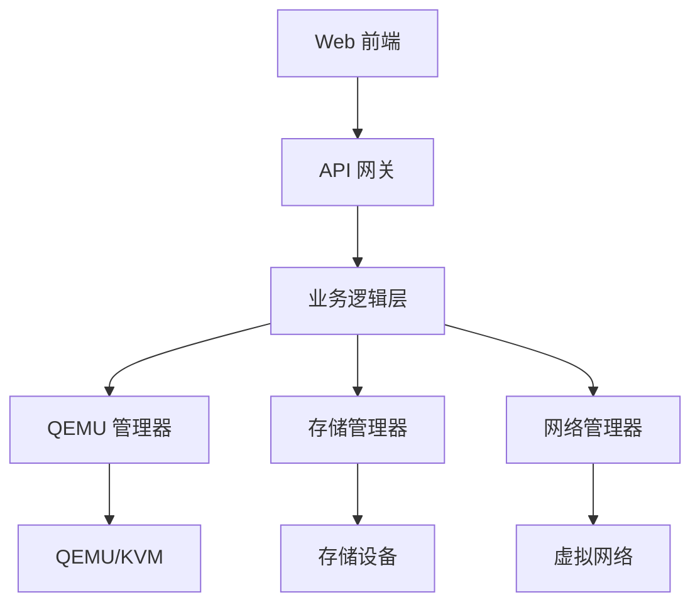

# 用户指南

欢迎使用 VoidVM！这里是完整的用户指南，帮助你快速上手并掌握 VoidVM 的所有功能。

## 什么是 VoidVM？

VoidVM 是一个现代化的虚拟机管理平台，旨在简化虚拟机的创建、管理和维护工作。它提供了：

- 🖥️ **直观的 Web 界面** - 无需命令行，通过浏览器即可完成所有操作
- ⚡ **高性能虚拟化** - 基于 QEMU/KVM 技术，提供接近原生的性能
- 🔧 **完整的生命周期管理** - 从创建到删除的全流程管理
- 📊 **实时监控** - 资源使用情况实时展示
- 🔒 **安全控制** - 完善的用户权限和访问控制

## 主要特性

### 虚拟机管理

- 创建和配置虚拟机
- 启动、停止、重启虚拟机
- 快照管理
- 克隆虚拟机
- 虚拟机导入导出

### 资源监控

- CPU 使用率监控
- 内存使用情况
- 磁盘 I/O 统计
- 网络流量监控

### 远程访问

- VNC 控制台
- SSH 连接管理
- 文件传输

### 网络管理

- 虚拟网络配置
- 端口转发设置
- 防火墙规则

## 架构概览

<MermaidZoom>

</MermaidZoom>

## 下一步

- [快速开始](/guide/getting-started) - 5分钟快速体验
- [安装部署](/guide/installation) - 详细的安装说明
- [配置说明](/guide/configuration) - 系统配置详解
