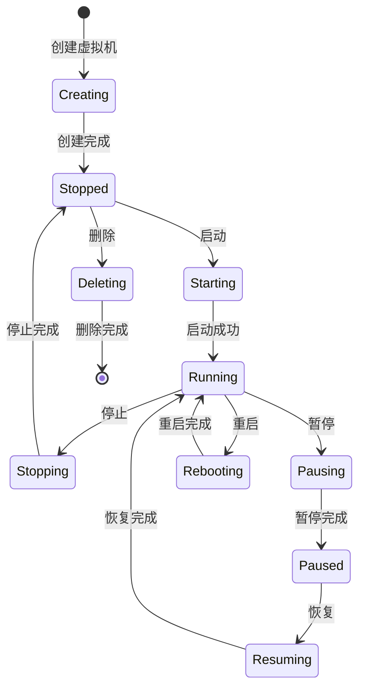

# 虚拟机管理

VoidVM 提供了完整的虚拟机生命周期管理功能，从创建、配置到监控、维护的全流程管理。

<VmDemo />

## 虚拟机生命周期

<MermaidZoom>



</MermaidZoom>

## 创建虚拟机

### 使用 Web 界面创建

1. **访问创建页面**

   - 登录 VoidVM 管理界面
   - 点击左侧菜单的"虚拟机"
   - 点击"创建虚拟机"按钮

2. **基础配置**

   | 配置项       | 说明                   | 推荐值           |
   | ------------ | ---------------------- | ---------------- |
   | 虚拟机名称   | 唯一标识符，支持中英文 | my-web-server    |
   | 描述         | 虚拟机用途说明         | Web服务器环境    |
   | 操作系统模板 | 预配置的系统镜像       | Ubuntu 20.04 LTS |

3. **硬件配置**

   | 资源类型 | 最小值 | 推荐值 | 最大值 | 说明               |
   | -------- | ------ | ------ | ------ | ------------------ |
   | CPU 核数 | 1      | 2      | 16     | 根据应用需求调整   |
   | 内存大小 | 512MB  | 2048MB | 32GB   | 影响性能的关键因素 |
   | 磁盘空间 | 10GB   | 20GB   | 500GB  | 系统+应用所需空间  |

4. **网络配置**

   ```yaml
   # 网络配置示例
   network:
     type: bridge # 网络类型：bridge/nat/host
     bridge: virbr0 # 网桥名称
     ip_mode: dhcp # IP分配：dhcp/static
     mac_address: auto # MAC地址：auto/custom
   ```

5. **高级选项**

   - **自动启动**: 系统启动时自动启动此虚拟机
   - **VNC 密码**: 远程控制台访问密码
   - **CPU 类型**: host-passthrough/host-model/custom
   - **启动顺序**: 硬盘/光驱/网络/软盘

### 使用 API 创建

```javascript
// 创建虚拟机的完整示例
const createVirtualMachine = async () => {
  const vmConfig = {
    // 基础信息
    name: 'web-server-01',
    description: 'Production web server',

    // 硬件配置
    hardware: {
      cpu: {
        cores: 4,
        threads: 2,
        model: 'host-passthrough',
      },
      memory: {
        size: 4096, // MB
        hugepages: false,
      },
      disk: {
        size: 50, // GB
        type: 'qcow2',
        cache: 'writeback',
        io: 'threads',
      },
    },

    // 网络配置
    network: {
      interfaces: [
        {
          type: 'bridge',
          bridge: 'virbr0',
          model: 'virtio',
          mac: null, // 自动生成
        },
      ],
    },

    // 操作系统
    os: {
      template: 'ubuntu-20.04-server',
      iso_path: '/data/isos/ubuntu-20.04.6-live-server-amd64.iso',
      boot_order: ['hd', 'cdrom'],
    },

    // 其他选项
    options: {
      autostart: false,
      vnc_password: 'secure123',
      description: 'Web server for production environment',
    },
  }

  try {
    const response = await fetch('/api/v1/vms', {
      method: 'POST',
      headers: {
        'Content-Type': 'application/json',
        Authorization: `Bearer ${authToken}`,
      },
      body: JSON.stringify(vmConfig),
    })

    const result = await response.json()

    if (result.success) {
      console.log('VM created:', result.data)
      return result.data
    } else {
      throw new Error(result.error.message)
    }
  } catch (error) {
    console.error('Failed to create VM:', error)
    throw error
  }
}

// 使用示例
createVirtualMachine()
  .then(vm => {
    console.log(`Virtual machine ${vm.name} created with ID: ${vm.id}`)
  })
  .catch(error => {
    console.error('Creation failed:', error.message)
  })
```

### 使用模板快速创建

```typescript
// 预定义模板
interface VmTemplate {
  id: string
  name: string
  description: string
  config: VmConfig
  category: 'web' | 'database' | 'development' | 'desktop'
}

const templates: VmTemplate[] = [
  {
    id: 'web-server-template',
    name: 'Web 服务器',
    description: 'Nginx + PHP + MySQL 环境',
    category: 'web',
    config: {
      cpu: 2,
      memory: 2048,
      disk: 30,
      os: 'ubuntu-20.04',
      preinstalled: ['nginx', 'php8.1', 'mysql-8.0'],
    },
  },
  {
    id: 'dev-environment',
    name: '开发环境',
    description: 'Node.js + Python + Docker 开发环境',
    category: 'development',
    config: {
      cpu: 4,
      memory: 4096,
      disk: 50,
      os: 'ubuntu-22.04',
      preinstalled: ['nodejs', 'python3', 'docker', 'vscode-server'],
    },
  },
]

// 使用模板创建
const createFromTemplate = async (templateId: string, vmName: string) => {
  const template = templates.find(t => t.id === templateId)
  if (!template) {
    throw new Error('Template not found')
  }

  const vmConfig = {
    name: vmName,
    template: templateId,
    ...template.config,
  }

  return await createVirtualMachine(vmConfig)
}
```

## 虚拟机操作

### 基本操作

#### 启动虚拟机

```typescript
// 启动虚拟机
const startVm = async (vmId: string, options?: StartOptions) => {
  const config = {
    vmId,
    bootMode: options?.bootMode || 'normal', // normal/recovery/cdrom
    snapshot: options?.snapshot || null, // 从快照启动
    console: options?.console || true, // 是否启用控制台
  }

  const response = await fetch(`/api/v1/vms/${vmId}/start`, {
    method: 'POST',
    headers: {
      'Content-Type': 'application/json',
      Authorization: `Bearer ${authToken}`,
    },
    body: JSON.stringify(config),
  })

  return response.json()
}

// 使用示例
await startVm('vm-001', {
  bootMode: 'normal',
  console: true,
})
```

#### 停止虚拟机

```typescript
// 优雅停止（推荐）
const stopVm = async (vmId: string, force = false) => {
  const config = {
    force, // 是否强制停止
    timeout: force ? 0 : 30, // 优雅停止超时时间（秒）
  }

  const response = await fetch(`/api/v1/vms/${vmId}/stop`, {
    method: 'POST',
    headers: {
      'Content-Type': 'application/json',
      Authorization: `Bearer ${authToken}`,
    },
    body: JSON.stringify(config),
  })

  return response.json()
}

// 立即强制停止（紧急情况使用）
const forceStopVm = async (vmId: string) => {
  return await stopVm(vmId, true)
}
```

#### 重启虚拟机

```typescript
const restartVm = async (vmId: string, mode: 'graceful' | 'force' = 'graceful') => {
  const response = await fetch(`/api/v1/vms/${vmId}/restart`, {
    method: 'POST',
    headers: {
      'Content-Type': 'application/json',
      Authorization: `Bearer ${authToken}`,
    },
    body: JSON.stringify({ mode }),
  })

  return response.json()
}
```

### 高级操作

#### 暂停和恢复

```typescript
// 暂停虚拟机（保存到内存）
const pauseVm = async (vmId: string) => {
  const response = await fetch(`/api/v1/vms/${vmId}/pause`, {
    method: 'POST',
    headers: { Authorization: `Bearer ${authToken}` },
  })
  return response.json()
}

// 恢复虚拟机
const resumeVm = async (vmId: string) => {
  const response = await fetch(`/api/v1/vms/${vmId}/resume`, {
    method: 'POST',
    headers: { Authorization: `Bearer ${authToken}` },
  })
  return response.json()
}
```

#### 挂起和唤醒

```typescript
// 挂起虚拟机（保存到磁盘）
const suspendVm = async (vmId: string) => {
  const response = await fetch(`/api/v1/vms/${vmId}/suspend`, {
    method: 'POST',
    headers: { Authorization: `Bearer ${authToken}` },
  })
  return response.json()
}

// 唤醒虚拟机
const wakeupVm = async (vmId: string) => {
  const response = await fetch(`/api/v1/vms/${vmId}/wakeup`, {
    method: 'POST',
    headers: { Authorization: `Bearer ${authToken}` },
  })
  return response.json()
}
```

## 虚拟机配置管理

### 硬件配置修改

#### CPU 配置

```typescript
// 修改 CPU 配置（需要关机状态）
const updateCpuConfig = async (vmId: string, cpuConfig: CpuConfig) => {
  const config = {
    cores: cpuConfig.cores, // CPU 核数
    threads: cpuConfig.threads, // 每核线程数
    sockets: cpuConfig.sockets, // CPU 插槽数
    model: cpuConfig.model, // CPU 模型
    features: cpuConfig.features, // CPU 特性
  }

  const response = await fetch(`/api/v1/vms/${vmId}/hardware/cpu`, {
    method: 'PUT',
    headers: {
      'Content-Type': 'application/json',
      Authorization: `Bearer ${authToken}`,
    },
    body: JSON.stringify(config),
  })

  return response.json()
}

// 使用示例
await updateCpuConfig('vm-001', {
  cores: 4,
  threads: 2,
  sockets: 1,
  model: 'host-passthrough',
  features: ['+vmx', '+aes'],
})
```

#### 内存配置

```typescript
// 修改内存配置
const updateMemoryConfig = async (vmId: string, memoryConfig: MemoryConfig) => {
  const config = {
    size: memoryConfig.size, // 内存大小（MB）
    maxSize: memoryConfig.maxSize, // 最大内存（热插拔）
    hugepages: memoryConfig.hugepages, // 是否使用大页内存
    numa: memoryConfig.numa, // NUMA 配置
  }

  const response = await fetch(`/api/v1/vms/${vmId}/hardware/memory`, {
    method: 'PUT',
    headers: {
      'Content-Type': 'application/json',
      Authorization: `Bearer ${authToken}`,
    },
    body: JSON.stringify(config),
  })

  return response.json()
}

// 热添加内存（虚拟机运行时）
const hotAddMemory = async (vmId: string, additionalMemoryMB: number) => {
  const response = await fetch(`/api/v1/vms/${vmId}/hardware/memory/hot-add`, {
    method: 'POST',
    headers: {
      'Content-Type': 'application/json',
      Authorization: `Bearer ${authToken}`,
    },
    body: JSON.stringify({ size: additionalMemoryMB }),
  })

  return response.json()
}
```

#### 磁盘管理

```typescript
// 添加新磁盘
const addDisk = async (vmId: string, diskConfig: DiskConfig) => {
  const config = {
    size: diskConfig.size, // 磁盘大小（GB）
    type: diskConfig.type, // 磁盘类型：qcow2/raw
    interface: diskConfig.interface, // 接口类型：virtio/scsi/ide
    cache: diskConfig.cache, // 缓存模式：writeback/writethrough/none
    target: diskConfig.target, // 目标设备：vda/vdb/sda等
  }

  const response = await fetch(`/api/v1/vms/${vmId}/disks`, {
    method: 'POST',
    headers: {
      'Content-Type': 'application/json',
      Authorization: `Bearer ${authToken}`,
    },
    body: JSON.stringify(config),
  })

  return response.json()
}

// 扩展磁盘大小
const expandDisk = async (vmId: string, diskId: string, newSizeGB: number) => {
  const response = await fetch(`/api/v1/vms/${vmId}/disks/${diskId}/expand`, {
    method: 'POST',
    headers: {
      'Content-Type': 'application/json',
      Authorization: `Bearer ${authToken}`,
    },
    body: JSON.stringify({ newSize: newSizeGB }),
  })

  return response.json()
}

// 删除磁盘
const removeDisk = async (vmId: string, diskId: string) => {
  const response = await fetch(`/api/v1/vms/${vmId}/disks/${diskId}`, {
    method: 'DELETE',
    headers: { Authorization: `Bearer ${authToken}` },
  })

  return response.json()
}

// 磁盘快照
const createDiskSnapshot = async (vmId: string, diskId: string, snapshotName: string) => {
  const response = await fetch(`/api/v1/vms/${vmId}/disks/${diskId}/snapshots`, {
    method: 'POST',
    headers: {
      'Content-Type': 'application/json',
      Authorization: `Bearer ${authToken}`,
    },
    body: JSON.stringify({ name: snapshotName }),
  })

  return response.json()
}
```

#### 网络接口管理

```typescript
// 添加网络接口
const addNetworkInterface = async (vmId: string, networkConfig: NetworkConfig) => {
  const config = {
    type: networkConfig.type, // bridge/nat/host/user
    bridge: networkConfig.bridge, // 网桥名称（bridge类型）
    model: networkConfig.model, // 网卡模型：virtio/e1000/rtl8139
    mac: networkConfig.mac, // MAC地址
    vlan: networkConfig.vlan, // VLAN标签
    bandwidth: networkConfig.bandwidth, // 带宽限制
  }

  const response = await fetch(`/api/v1/vms/${vmId}/network-interfaces`, {
    method: 'POST',
    headers: {
      'Content-Type': 'application/json',
      Authorization: `Bearer ${authToken}`,
    },
    body: JSON.stringify(config),
  })

  return response.json()
}

// 配置端口转发
const setupPortForwarding = async (vmId: string, rules: PortForwardingRule[]) => {
  const config = {
    rules: rules.map(rule => ({
      protocol: rule.protocol, // tcp/udp
      hostPort: rule.hostPort, // 主机端口
      guestPort: rule.guestPort, // 虚拟机端口
      hostIp: rule.hostIp || '0.0.0.0', // 绑定的主机IP
    })),
  }

  const response = await fetch(`/api/v1/vms/${vmId}/port-forwarding`, {
    method: 'PUT',
    headers: {
      'Content-Type': 'application/json',
      Authorization: `Bearer ${authToken}`,
    },
    body: JSON.stringify(config),
  })

  return response.json()
}

// 使用示例
await setupPortForwarding('vm-001', [
  { protocol: 'tcp', hostPort: 8080, guestPort: 80 }, // HTTP
  { protocol: 'tcp', hostPort: 8443, guestPort: 443 }, // HTTPS
  { protocol: 'tcp', hostPort: 2222, guestPort: 22 }, // SSH
])
```

## 快照管理

### 创建快照

```typescript
// 创建完整快照（包含磁盘和内存）
const createFullSnapshot = async (vmId: string, snapshotConfig: SnapshotConfig) => {
  const config = {
    name: snapshotConfig.name,
    description: snapshotConfig.description,
    includeMemory: true, // 包含内存状态
    includeDisk: true, // 包含磁盘状态
    atomic: true, // 原子操作
  }

  const response = await fetch(`/api/v1/vms/${vmId}/snapshots`, {
    method: 'POST',
    headers: {
      'Content-Type': 'application/json',
      Authorization: `Bearer ${authToken}`,
    },
    body: JSON.stringify(config),
  })

  return response.json()
}

// 创建磁盘快照（仅磁盘状态）
const createDiskOnlySnapshot = async (vmId: string, name: string, description?: string) => {
  const config = {
    name,
    description: description || `Disk snapshot created at ${new Date().toISOString()}`,
    includeMemory: false,
    includeDisk: true,
    atomic: true,
  }

  const response = await fetch(`/api/v1/vms/${vmId}/snapshots`, {
    method: 'POST',
    headers: {
      'Content-Type': 'application/json',
      Authorization: `Bearer ${authToken}`,
    },
    body: JSON.stringify(config),
  })

  return response.json()
}
```

### 快照操作

```typescript
// 获取快照列表
const getSnapshots = async (vmId: string) => {
  const response = await fetch(`/api/v1/vms/${vmId}/snapshots`, {
    headers: { Authorization: `Bearer ${authToken}` },
  })

  return response.json()
}

// 恢复到快照
const restoreSnapshot = async (vmId: string, snapshotId: string) => {
  const response = await fetch(`/api/v1/vms/${vmId}/snapshots/${snapshotId}/restore`, {
    method: 'POST',
    headers: { Authorization: `Bearer ${authToken}` },
  })

  return response.json()
}

// 删除快照
const deleteSnapshot = async (vmId: string, snapshotId: string) => {
  const response = await fetch(`/api/v1/vms/${vmId}/snapshots/${snapshotId}`, {
    method: 'DELETE',
    headers: { Authorization: `Bearer ${authToken}` },
  })

  return response.json()
}

// 快照链合并
const mergeSnapshots = async (vmId: string, sourceSnapshotId: string, targetSnapshotId: string) => {
  const response = await fetch(`/api/v1/vms/${vmId}/snapshots/merge`, {
    method: 'POST',
    headers: {
      'Content-Type': 'application/json',
      Authorization: `Bearer ${authToken}`,
    },
    body: JSON.stringify({
      source: sourceSnapshotId,
      target: targetSnapshotId,
    }),
  })

  return response.json()
}
```

### 自动快照

```typescript
// 配置自动快照
const setupAutoSnapshot = async (vmId: string, policy: AutoSnapshotPolicy) => {
  const config = {
    enabled: policy.enabled,
    schedule: policy.schedule, // cron 表达式
    maxSnapshots: policy.maxSnapshots, // 最大保留数量
    naming: policy.naming, // 命名规则
    includeMemory: policy.includeMemory,
  }

  const response = await fetch(`/api/v1/vms/${vmId}/auto-snapshot`, {
    method: 'PUT',
    headers: {
      'Content-Type': 'application/json',
      Authorization: `Bearer ${authToken}`,
    },
    body: JSON.stringify(config),
  })

  return response.json()
}

// 使用示例：每天凌晨2点自动创建快照
await setupAutoSnapshot('vm-001', {
  enabled: true,
  schedule: '0 2 * * *', // 每天凌晨2点
  maxSnapshots: 7, // 保留7个快照
  naming: 'auto-{timestamp}', // 自动命名规则
  includeMemory: false, // 仅磁盘快照
})
```

## 虚拟机监控

### 实时性能监控

```typescript
// 获取虚拟机性能指标
const getVmMetrics = async (vmId: string, timeRange?: TimeRange) => {
  const params = new URLSearchParams()
  if (timeRange) {
    params.append('from', timeRange.from.toISOString())
    params.append('to', timeRange.to.toISOString())
  }

  const response = await fetch(`/api/v1/vms/${vmId}/metrics?${params}`, {
    headers: { Authorization: `Bearer ${authToken}` },
  })

  return response.json()
}

// WebSocket 实时监控
const startRealtimeMonitoring = (vmId: string, callback: (metrics: VmMetrics) => void) => {
  const ws = new WebSocket(`${wsUrl}?token=${authToken}`)

  ws.onopen = () => {
    // 订阅虚拟机指标
    ws.send(
      JSON.stringify({
        type: 'subscribe',
        data: {
          topic: 'vm-metrics',
          vmId: vmId,
          interval: 5000, // 5秒更新间隔
        },
      })
    )
  }

  ws.onmessage = event => {
    const message = JSON.parse(event.data)
    if (message.type === 'vm-metrics' && message.data.vmId === vmId) {
      callback(message.data.metrics)
    }
  }

  return ws
}

// 使用示例
const ws = startRealtimeMonitoring('vm-001', metrics => {
  console.log('CPU Usage:', metrics.cpu.usage + '%')
  console.log('Memory Usage:', metrics.memory.usage + '%')
  console.log('Disk I/O:', metrics.disk.read + '/' + metrics.disk.write + ' MB/s')
  console.log('Network I/O:', metrics.network.rx + '/' + metrics.network.tx + ' MB/s')
})
```

### 性能分析

```typescript
// 获取性能分析报告
const getPerformanceReport = async (vmId: string, period: '1h' | '24h' | '7d' | '30d') => {
  const response = await fetch(`/api/v1/vms/${vmId}/performance-report?period=${period}`, {
    headers: { Authorization: `Bearer ${authToken}` },
  })

  return response.json()
}

// 设置性能告警
const setupPerformanceAlerts = async (vmId: string, alerts: PerformanceAlert[]) => {
  const config = {
    alerts: alerts.map(alert => ({
      metric: alert.metric, // cpu/memory/disk/network
      threshold: alert.threshold, // 阈值
      condition: alert.condition, // >/</=/!=
      duration: alert.duration, // 持续时间（秒）
      action: alert.action, // notify/restart/suspend
    })),
  }

  const response = await fetch(`/api/v1/vms/${vmId}/alerts`, {
    method: 'PUT',
    headers: {
      'Content-Type': 'application/json',
      Authorization: `Bearer ${authToken}`,
    },
    body: JSON.stringify(config),
  })

  return response.json()
}

// 使用示例：设置CPU和内存告警
await setupPerformanceAlerts('vm-001', [
  {
    metric: 'cpu',
    threshold: 80,
    condition: '>',
    duration: 300, // 5分钟
    action: 'notify',
  },
  {
    metric: 'memory',
    threshold: 90,
    condition: '>',
    duration: 60, // 1分钟
    action: 'notify',
  },
])
```

## 远程访问和控制

### VNC 控制台

```typescript
// 获取 VNC 连接信息
const getVncInfo = async (vmId: string) => {
  const response = await fetch(`/api/v1/vms/${vmId}/console/vnc`, {
    headers: { Authorization: `Bearer ${authToken}` },
  })

  return response.json()
}

// 连接 VNC 控制台
const connectVnc = async (vmId: string) => {
  const vncInfo = await getVncInfo(vmId)

  // 打开新窗口显示 VNC 控制台
  const consoleUrl = `/console/vnc/${vmId}?token=${authToken}`
  window.open(consoleUrl, '_blank', 'width=1024,height=768')
}

// VNC 设置配置
const configureVnc = async (vmId: string, vncConfig: VncConfig) => {
  const config = {
    enabled: vncConfig.enabled,
    password: vncConfig.password,
    port: vncConfig.port,
    listen: vncConfig.listen, // 监听地址
    keymap: vncConfig.keymap, // 键盘映射
  }

  const response = await fetch(`/api/v1/vms/${vmId}/console/vnc/config`, {
    method: 'PUT',
    headers: {
      'Content-Type': 'application/json',
      Authorization: `Bearer ${authToken}`,
    },
    body: JSON.stringify(config),
  })

  return response.json()
}
```
